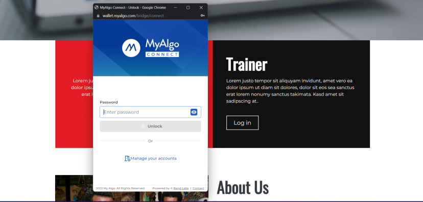

[](https://choosealicense.com/licenses/mit/)
# End-to-End Web3 dApps:
## certificate generation, distribution, and value transfer with Algorand NFTs and smart contracts 
**Business Need**

Web3 technology is inherently about the user controlled internet. It is being achieved by a growing stack of decentralized technologies, such as blockchains, smart contracts, oracles, crypto wallets, storage networks, and more.   

In this project, the client is 10 Academy; the client would like to solve the challenge of ensuring that certificates are available to all trainees in a secure way, and (if possible) that certificate holders can benefit from smart contract actions now and in the future.  At present, certificates are distributed as simple PDF files, without the ability to verify their authenticity nor can 10 Academy undertake smart actions with the trainees/their contracts.

10 Academy has partnered with Algorand to use the Algorand Blockchain as the foundational element of the NFT, and this must now be implemented.  In this project you will build end-to-end Web3 dapps on the Algorand Blockchain that will help 10 Academy generate and distribute Non-Fungible Tokens (NFTs) as certificates that will represent the successful completion of a weekly challenge to trainees, and allow trainees with NFTs to interact with a smart contract to perform pre-defined actions.  
______
### Project structure
You will find two implementations of algorand transactions and NFT creation in this project:

1. Using JS SDK and
2. Using python SDK

You wil find a designated folders for each implementation. Moreover, a react app is on development for facilitating the buisness requirements.
__________
## Folder Structure
### You will find the following directories in this project
1. `api` - consists scripts for a FastAPI development
2. `images` - contains screenshots of the frontend app
3. `NFT_js` - Create an asset, transfer an asset, and opt-in implementation using JS SDK
4. `NFT_py` - Create an asset, transfer an asset, and opt-in implementation using Python SDK
5. `notebooks` - here your will find two files: algo_starter and asset notebooks. These files will try to show the basic implementations of algoSDK.
6. `react` - Lastly, you will find the frontend react app in this directory.
__________
## Tech Stack
I have used the following techstacks for making this dApp
- React
- JS Algo SDK
- MyAlgoConnect Wallet API
- Pinata ipfs: The InterPlanetary File System is a protocol, hypermedia and file sharing peer-to-peer network for storing and sharing data in a distributed file system
- PurestakAPI : PureStake is Infrastructure-as-a-Service that can be used instead of sandbox
- MySQL : this should be deprecated for future work
___

The frontend react app is integrated with *MyAlgoWallet* which will be used as a login method for trainess. 

## Screenshots
Home Page


Login with MyAlgo


Trainer can see List of Trainees here


Trainer can see detail before creating an asset for a trainee


Once Trainee request asset transfer, Trainer will be able to either approve or decline

____
## Installation
Before installing this app, you need to prepare a few things
- install node.js
- prepare a `config.py` file in the api folder

your config file should look like this

```bash
# create pinata api account and input the following
API_KEY = "your api key"
API_SECRET ="your api secret key"
# generate app email password from your gmail
EPASS= "your generated app password"
```

```bash
git clone https://github.com/Nathnael12/web3_certificate_generation_verification.git

cd web3_certificate_generation_verification

# start api
cd api
uvicorn app:app --reload

# start react frontend
# go to the react folder first 
# from the api folder . . . .
cd ../react
npm run start


```
